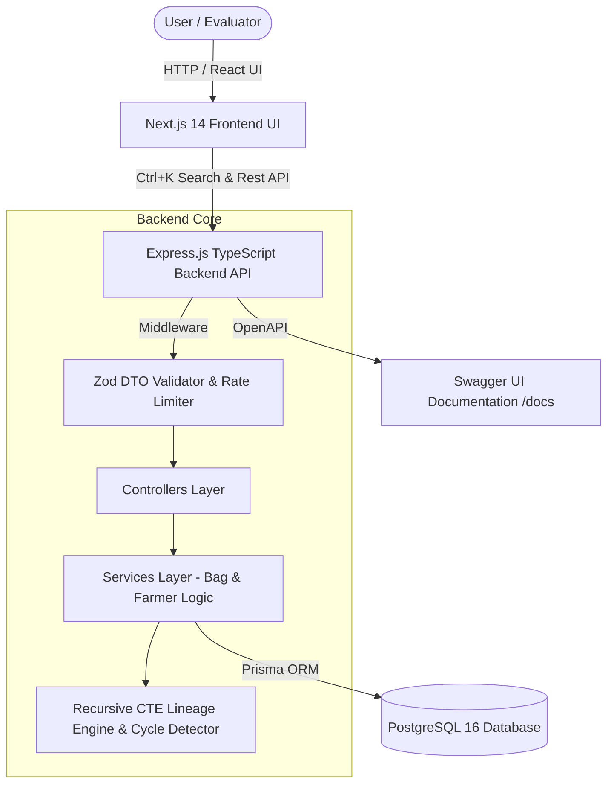
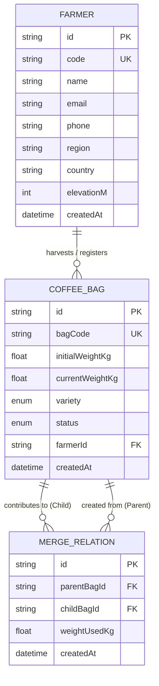
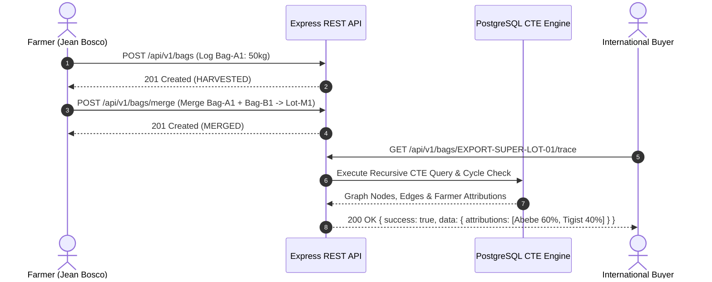

# CoffeeTrace • SLR Enterprise Coffee Traceability System
## Production-Grade Multi-Tier Lineage Engine & Farmer Attribution Platform

[](https://www.typescriptlang.org/)
[](https://nextjs.org/)
[](https://nodejs.org/)
[](https://expressjs.com/)
[](https://www.postgresql.org/)
[](https://www.prisma.io/)
[](https://reactflow.dev/)
[](https://www.docker.com/)
[](http://localhost:4000/docs)

**CoffeeTrace** is an enterprise-grade SaaS application designed and engineered for the **SLR Enterprise Technical Assessment**. It addresses complex coffee supply chain challenges: multi-tier harvest bag aggregation, recursive lineage tracking, zero-cycle loop guarantees, fair farmer percentage attribution, and verifiable digital origin certification.

---

## 🌟 Key Platform Features & Highlights

- 🔄 **Traceability Replay Engine (⭐ Core Highlight):** Step-by-step 5–10 second animated playback demonstrating how smallholder farmer harvest bags recursively merge across tiers into final export lots.
- 📜 **Coffee Origin Export Certificate Generator:** One-click downloadable & printable certificates featuring Export Lot ID, participating farmers, origin regions, timestamps, QR codes, and immutable SHA-256 digital signature hashes.
- ⚡ **Command Palette (`Ctrl + K` / `Cmd + K`):** Global quick-search and action overlay for instant navigation across farmers, coffee bags, merges, and system settings.
- 👤 **Farmer Profile Side Drawer:** Interactive slide-over panel displaying farmer contact info, lifetime bag count, total yield, average weight, harvest timeline, and export contribution history.
- 🛡️ **System Activity Audit Log:** Full audit trail logging harvest creation, merge operations, lineage queries, and export certificate generations.
- 📊 **Executive Dashboard & System Health:** Real-time activity timeline, recent farmer registrations, variety weight distribution, and live health monitors (API, Database, Storage, Deployment).
- 🛡️ **Strict Pagination Guard & Validation:** Max 5 records per page strictly enforced across all REST API endpoints (`/farmers`, `/bags`) via Zod input DTOs and SQL limit parameters.

---

## 🏛️ System Architecture Diagram



---

## 📊 Entity Relationship (ER) Diagram



---

## 🔄 Multi-Tier Data Flow Diagram



---

## 📂 Project Directory Structure

```
.
├── backend/
│   ├── prisma/
│   │   ├── schema.prisma         # PostgreSQL schema (Farmer, CoffeeBag, MergeRelation)
│   │   └── seed.ts               # Pre-populated seed dataset (3-tier export lots)
│   ├── src/
│   │   ├── controllers/          # Request handlers & JSON envelope formatters
│   │   ├── dtos/                 # Zod validation schemas
│   │   ├── middleware/           # Central error handler, rate limiters
│   │   ├── repositories/         # Prisma database access layer
│   │   ├── routes/               # Express API v1 route mounts & Swagger spec
│   │   ├── services/             # Recursive CTE lineage, cycle detection, merge logic
│   │   ├── types/                # TypeScript type definitions
│   │   ├── app.ts                # Express application factory
│   │   └── server.ts             # Server entry point
│   ├── tests/
│   │   ├── unit/                 # Unit tests (Traceability, Merge Logic, BagService)
│   │   └── integration/          # Integration tests (REST endpoints)
│   ├── Dockerfile
│   └── package.json
├── frontend/
│   ├── src/
│   │   ├── app/
│   │   │   ├── bags/             # Coffee bags inventory & status filters page
│   │   │   ├── farmers/          # Farmers directory & stats page
│   │   │   ├── settings/         # System health & platform settings page
│   │   │   ├── trace/[id]/       # Interactive lineage graph & replay page
│   │   │   ├── globals.css       # Tailwind CSS tokens & glassmorphism
│   │   │   ├── page.tsx          # Executive Dashboard
│   │   │   └── providers.tsx     # React Query & Toast context providers
│   │   ├── components/
│   │   │   ├── AuditLogModal.tsx # System activity audit log viewer
│   │   │   ├── BagsTable.tsx     # Density switcher, status badges, filters
│   │   │   ├── CertificateModal.tsx # Export origin certificate generator
│   │   │   ├── CommandPalette.tsx # Ctrl+K global search & actions
│   │   │   ├── FarmerProfileDrawer.tsx # Slide-over farmer profile panel
│   │   │   ├── FarmersTable.tsx  # Kebab action dropdown & stats bar
│   │   │   ├── LogBagModal.tsx   # Coffee bag harvest ingestion modal
│   │   │   ├── MergeModal.tsx    # Multi-bag merge execution modal
│   │   │   ├── Navbar.tsx        # Top header & quick search bar
│   │   │   ├── RegisterFarmerModal.tsx # Farmer onboarding modal
│   │   │   ├── Sidebar.tsx       # Enterprise navigation & pagination guard indicator
│   │   │   └── TraceabilityGraph.tsx # React Flow DAG & Lineage Replay Engine
│   │   ├── context/              # Toast & Sidebar state context
│   │   ├── lib/                  # Axios API client
│   │   └── types/                # Frontend TypeScript types
│   ├── Dockerfile
│   └── package.json
├── docker-compose.yml            # Docker stack (DB, Backend, Frontend)
└── README.md
```

---

## 🛠️ Technology Stack

| Layer | Technology |
| :--- | :--- |
| **Frontend Framework** | Next.js 14 (App Router), React 18, TypeScript |
| **Styling & UI** | Tailwind CSS, Lucide Icons, Glassmorphism design system |
| **Visual Graph** | React Flow (`@xyflow/react`) |
| **Backend Framework** | Node.js, Express.js, TypeScript |
| **Database & ORM** | PostgreSQL 16, Prisma ORM |
| **State & Data Fetching** | TanStack React Query v5 |
| **Validation & Docs** | Zod DTOs, Swagger UI (`/docs`) |
| **Testing** | Jest, Supertest |
| **DevOps** | Docker, Docker Compose |

---

## 🚀 Quick Setup Guide (Docker Compose)

### 1. Run with Docker Compose (Recommended)

Run the full stack with one command:

```bash
docker compose up --build
```

### 2. Access Platform Endpoints

- 🖥️ **Frontend Application:** `http://localhost:3000`
- ⚙️ **Backend REST API:** `http://localhost:4000/api/v1`
- 📚 **Swagger API Documentation:** `http://localhost:4000/docs`

---

## 🧪 Running Automated Tests

Run the backend unit and integration test suite:

```bash
cd backend
npm test
```

---

## 💡 Future Improvements

1. **IoT RFID Bag Tracking Integration:** Webhook listeners for real-time sensor weight and moisture updates during transport.
2. **Blockchain Hash Anchoring:** Optional public ledger anchoring for export certificates (e.g. Hedera / Polygon).
3. **Multi-Currency Farmer Payout Calculator:** Automatic calculation of fair farmer revenue share based on weight attribution percentage.

---

## 📄 License & Attribution
Prepared specifically for the **SLR Enterprise Technical Assessment**.
